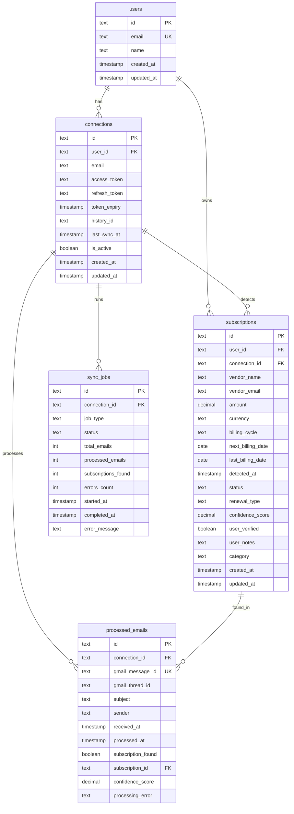

# Database Schema Diagram

## Entity Relationship Diagram



## Table Details

### Core Tables

#### `users` Table
- **Purpose**: Multi-user foundation (single-user MVP implementation)
- **Key Fields**: 
  - `id`: Primary key (defaults to '1' for MVP)
  - `email`: User's email address
  - `name`: User's display name

#### `connections` Table
- **Purpose**: Gmail OAuth connections and sync state
- **Key Fields**:
  - `user_id`: Links to users table (defaults to '1')
  - `access_token`/`refresh_token`: Gmail API credentials
  - `history_id`: Gmail history ID for incremental sync
  - `last_sync_at`: Timestamp of last successful sync

#### `subscriptions` Table
- **Purpose**: Core business data - detected subscriptions
- **Key Fields**:
  - `vendor_name`: Service provider name
  - `amount`/`currency`: Billing amount
  - `billing_cycle`: 'monthly', 'yearly', 'weekly', 'one-time'
  - `next_billing_date`/`last_billing_date`: Important dates
  - `confidence_score`: LLM detection confidence (0.00-1.00)
  - `status`: 'active', 'inactive', 'paused', 'unknown' (subscription access state)
  - `renewal_type`: 'auto_renew', 'manual_renew', 'cancelled', 'free_tier', 'unknown' (billing behavior)
  - `user_verified`: Whether user has confirmed the subscription

### Processing Tables

#### `processed_emails` Table
- **Purpose**: Prevent duplicate email processing
- **Key Fields**:
  - `gmail_message_id`: Unique Gmail message identifier
  - `subscription_found`: Boolean flag for LLM detection
  - `subscription_id`: Links to detected subscription (if any)
  - `processing_error`: Error message if processing failed

#### `sync_jobs` Table
- **Purpose**: Track batch processing progress
- **Key Fields**:
  - `job_type`: 'initial_sync', 'incremental_sync', 'manual_sync'
  - `status`: 'running', 'completed', 'failed', 'cancelled'
  - Progress counters: `total_emails`, `processed_emails`, `subscriptions_found`, `errors_count`

## Key Indexes

```sql
-- Performance indexes for common queries
CREATE INDEX idx_subscriptions_user_status ON subscriptions(user_id, status);
CREATE INDEX idx_subscriptions_next_billing ON subscriptions(next_billing_date) WHERE status = 'active';
CREATE INDEX idx_subscriptions_renewal_type ON subscriptions(renewal_type);
CREATE INDEX idx_processed_emails_connection ON processed_emails(connection_id, processed_at);
CREATE INDEX idx_processed_emails_gmail_id ON processed_emails(gmail_message_id);
CREATE INDEX idx_sync_jobs_status ON sync_jobs(status, started_at);
CREATE INDEX idx_connections_user_active ON connections(user_id, is_active);
```

## Data Flow Relationships

1. **User Setup**: `users` → `connections` (OAuth flow)
2. **Email Processing**: `connections` → `processed_emails` (batch processing)
3. **Subscription Detection**: `processed_emails` → `subscriptions` (LLM detection)
4. **Sync Tracking**: `connections` → `sync_jobs` (progress monitoring)

## Subscription Status Model

The subscription table uses a **two-field approach** to handle the complexity of real-world subscription states:

### Status Field (Access State)
- `active`: User currently has access to the service
- `inactive`: No current access (expired, cancelled, suspended)  
- `paused`: Temporarily paused (user-initiated or service-provided pause)
- `unknown`: LLM couldn't determine access state

### Renewal Type Field (Billing Behavior)
- `auto_renew`: Will automatically charge on next billing date
- `manual_renew`: Requires manual action to renew  
- `cancelled`: User cancelled, no future charges expected
- `free_tier`: Active service with no charges (free plan)
- `unknown`: Billing behavior unclear from emails

### Common Combinations
- **Active Netflix**: `status='active'`, `renewal_type='auto_renew'`
- **Free Spotify**: `status='active'`, `renewal_type='free_tier'`
- **Cancelled but still accessible**: `status='active'`, `renewal_type='cancelled'`
- **Expired subscription**: `status='inactive'`, `renewal_type='cancelled'`
- **Paused subscription**: `status='paused'`, `renewal_type='auto_renew'`

## MVP Implementation Notes

- **Single User**: All tables default to `user_id = '1'`
- **No Email Storage**: Email content never persisted, only metadata
- **Incremental Sync**: Uses `connections.history_id` and `last_sync_at`
- **Deduplication**: `processed_emails.gmail_message_id` prevents re-processing
- **Progress Tracking**: `sync_jobs` provides real-time sync status 